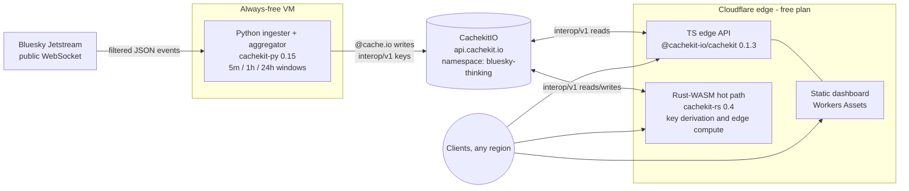

# Skyline (`bluesky-thinking`)

**Live Bluesky firehose analytics, served from one CacheKit namespace by three SDKs.**

Skyline turns the public [Bluesky Jetstream](https://github.com/bluesky-social/jetstream) into
rolling analytics — trending hashtags, links, language mix, posts-per-minute, top emoji — computed
by a Python ingester, served from a TypeScript edge API, with a Rust-WASM hot path, all reading and
writing the **same** [CacheKit](https://cachekit.io) cache entries. The demo *is* a live cross-SDK
interop test, and a working proof of CacheKit's differentiators:

- **Metered-misses pricing made literal** — a cache miss is a real window recompute; the hit rate
  is the product story.
- **Distributed locking** — concurrent misses on one window trigger exactly one recompute
  (stampede prevention via the CachekitIO SaaS lock endpoints).
- **Zero-knowledge encryption** — a sensitive derived cache uses `@cache.secure`; the backend
  stores ciphertext only.
- **≈ $0/month** — all third-party hosting stays inside free tiers (cost table below).

> Status: **Stage 1 spike complete** (LAB-735). Architecture locked in
> [`docs/architecture.md`](docs/architecture.md); build stages are groomed from it.

## Architecture



All three SDKs address the cache with **interop/v1** keys (`bluesky-thinking:{operation}:{args_hash}`)
— byte-identical across languages, proven in the spike (see below). Full contract:
[`docs/architecture.md`](docs/architecture.md).

## Spike results (Stage 1, 2026-07-24)

| Check | Result | Evidence |
| :--- | :--- | :--- |
| Python decorators `@cache.production` / `@cache.secure` / `@cache.io` | ✅ present + run on `cachekit==0.15.0` (PyPI) | [`spike/decorators/`](spike/decorators/) |
| `cachekit-rs` compiles for `wasm32-unknown-unknown` | ✅ SDK CI recipe + downstream consumer crate | [`spike/edge-worker/`](spike/edge-worker/) |
| `cachekit-rs` Worker **deploys and runs** on Cloudflare | ✅ live at `lab-735-skyline-spike.raywalker.workers.dev`, 180 KiB gzipped, 2 ms startup | [`spike/edge-worker/`](spike/edge-worker/) |
| Cross-SDK key byte-compatibility | ✅ Python (PyPI), TS (npm), Rust (live CF edge) all derive `bluesky-thinking:posts_per_minute:230037de…` | [`docs/architecture.md`](docs/architecture.md#locked-key-convention) |
| CachekitIO namespace + credentials | ⏳ blocked on interactive `ck login` (human step) — runbook ready | [`docs/architecture.md`](docs/architecture.md#provisioning-runbook) |
| Free-tier hosts chosen | ✅ Oracle Always Free (ingester) · Cloudflare Workers free (edge) · Render free (fallback) | [`docs/architecture.md`](docs/architecture.md#hosting) |

## Cost table (AC-8)

| Component | Host | Free-tier limit | Skyline's use | Cost |
| :--- | :--- | :--- | :--- | ---: |
| Jetstream feed | Bluesky public infra | none (public, no auth) | 1 WebSocket consumer | $0 |
| Python ingester | Oracle Cloud Always Free (Ampere A1) | 2 OCPU / 12 GB RAM always-on¹ | ~0.25 OCPU / 512 MB | $0 |
| Edge API + WASM | Cloudflare Workers free plan | 100k req/day, 10 ms CPU/invocation | cached reads, ≪ limits | $0 |
| Dashboard | Cloudflare Workers Assets | static asset requests free | tiny static site | $0 |
| Cache backend | CachekitIO (ours) | n/a — dogfood | one demo tenant | $0² |
| **Total** | | | | **$0/mo** |

¹ Halved from 4 OCPU / 24 GB on 2026-06-15; still far more than needed. Fallback: Render free web
service (750 instance-hrs/mo) kept warm by a Cloudflare Worker cron ping.
² CachekitIO is the platform being showcased — we build, run, and own it. No third-party line item.

Fly.io was evaluated and **rejected**: its free tier was discontinued in 2024 (new orgs get a
one-time trial credit only; an always-on 256 MB machine bills ≈ $2/mo).

## Repository layout

```
docs/architecture.md   — the Stage-1 architecture spec (locked contract)
edge/                  — Stage-2 TS edge API + dashboard: CF Worker serving the five aggregates (interop/v1 reads, X-Cache + hit-rate stats) + Workers Assets dashboard
spike/decorators/      — AC-3 proof: the three decorators running on cachekit 0.15.0
spike/edge-worker/     — AC-2 proof: deployable cachekit-rs Worker (the live spike)
spike/roundtrip/       — AC-1 harness: CachekitIO round-trip, runs as soon as credentials exist
```

Spike code is throwaway by design — Stage 2 replaces it with the production ingester/API/dashboard.

## License

MIT — see [LICENSE](LICENSE).
