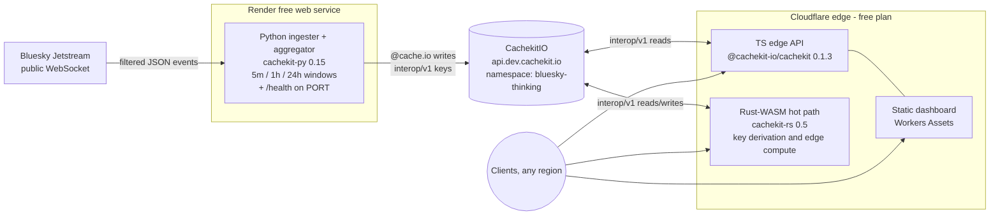

# Skyline (`bluesky-thinking`)

**Live Bluesky firehose analytics, served from one CacheKit namespace by three SDKs.**

Skyline turns the public [Bluesky Jetstream](https://github.com/bluesky-social/jetstream) into
rolling analytics — trending hashtags, links, language mix, posts-per-minute, top emoji — computed
by a Python ingester, served from a TypeScript edge API, with a Rust-WASM hot path, all reading and
writing the **same** [CacheKit](https://cachekit.io) cache entries. The demo *is* a live cross-SDK
interop test, and a working proof of CacheKit's differentiators:

- **Metered-misses pricing made literal** — a cache miss is a real window recompute; the hit rate
  is the product story.
- **Distributed locking** — concurrent misses on one window trigger exactly one recompute
  (stampede prevention via the CachekitIO SaaS lock endpoints).
- **Zero-knowledge encryption** — a sensitive derived cache uses `@cache.secure`; the backend
  stores ciphertext only.
- **≈ $0/month** — all third-party hosting stays inside free tiers (cost table below).

> Status: **Stage 3 merged (live cross-SDK integration proven), Stage 4 deploy in progress**
> (LAB-738). Architecture locked in [`docs/architecture.md`](docs/architecture.md); build stages
> are groomed from it.

## Architecture



All three SDKs address the cache with **interop/v1** keys (`bluesky-thinking:{operation}:{args_hash}`)
— byte-identical across languages, proven in the spike (see below). Full contract:
[`docs/architecture.md`](docs/architecture.md).

## Spike results (Stage 1, 2026-07-24)

| Check | Result | Evidence |
| :--- | :--- | :--- |
| Python decorators `@cache.production` / `@cache.secure` / `@cache.io` | ✅ present + run on `cachekit==0.15.0` (PyPI) | [`spike/decorators/`](spike/decorators/) |
| `cachekit-rs` compiles for `wasm32-unknown-unknown` | ✅ SDK CI recipe + downstream consumer crate | [`spike/edge-worker/`](spike/edge-worker/) |
| `cachekit-rs` Worker **deploys and runs** on Cloudflare | ✅ live at `lab-735-skyline-spike.raywalker.workers.dev`, 180 KiB gzipped, 2 ms startup | [`spike/edge-worker/`](spike/edge-worker/) |
| Cross-SDK key byte-compatibility | ✅ Python (PyPI), TS (npm), Rust (live CF edge) all derive `bluesky-thinking:posts_per_minute:230037de…` | [`docs/architecture.md`](docs/architecture.md#locked-key-convention) |
| CachekitIO namespace + credentials | ✅ creds exist at `op://cachekit/ck-dev-bluesky-default`, round-trip verified against `api.dev.cachekit.io` (Stage 3) | [`docs/architecture.md`](docs/architecture.md#credentials) |
| Free-tier hosts chosen | ✅ Render free web service (ingester) · Cloudflare Workers free (edge) | [`docs/architecture.md`](docs/architecture.md#hosting) |

## Cost table (AC-8)

Third-party hosting only, with the **binding** limit for each row — not just "free". Verified
against the providers' published limits, 2026-07-29.

| Component | Host | Binding free-tier limit | Skyline's use | Cost |
| :--- | :--- | :--- | :--- | ---: |
| Jetstream feed | Bluesky public infra | none (public, no auth) | 1 outbound WebSocket | $0 |
| Python ingester | Render free **web service**¹ | **750 instance-hrs/month, workspace-wide.** A 31-day month is 744 h, so exactly **one** always-on free service fits, with ~6 h to spare — a second would exhaust the budget and suspend every free service in the workspace | one always-on service, kept warm by the CF cron ping | $0 |
| Edge API + dashboard + Rust-WASM hot path | Cloudflare Workers free plan | **100k requests/day and 10 ms CPU per invocation, shared across both Workers** (`skyline-edge` incl. its cron, `skyline-hotpath`) | cached reads, ≪ limits; the hot path is reached by service binding (its subrequests don't hit the public URL) | $0 |
| Keep-alive cron | Cloudflare cron trigger on `skyline-edge` | cron triggers are free; each firing counts as a request in the same 100k/day budget | ~144 pings/day (every 10 min) ≈ **4,464/month — 0.14 % of the daily request budget** | $0 |
| Cache backend | CachekitIO (ours) | n/a — dogfood | one demo tenant | $0² |
| **Total** | | | | **$0/mo** |

¹ Web services are the **only** service type on Render's free tier — background workers and cron
jobs are paid, which is why the ingester serves `GET /health` on `$PORT` and why the keep-alive is
a Cloudflare cron, not a Render one. Free services spin down after 15 min without *inbound* traffic
(the outbound Jetstream socket doesn't count); the cron ping supplies that traffic. Restarts lose
in-memory window state, mitigated by checkpointing aggregation state into CacheKit (`posts_per_minute`
and `lang_mix` restore exactly; per-minute trending counters are top-K-truncated in the snapshot, so
long-tail counts are approximate after a restart).
² CachekitIO is the platform being showcased — we build, run, and own it. No third-party line item.

Fly.io was evaluated and **rejected**: its free tier was discontinued in 2024 (new orgs get a
one-time trial credit only; an always-on 256 MB machine bills ≈ $2/mo). Oracle Cloud's always-free
VM was dropped in Stage 3 grooming (credit-card requirement); Render replaced it.

## Deploy (Stage 4)

No CI/CD by design — a demo deploys by hand:

- **Ingester (Render)**: [`render.yaml`](render.yaml) is the blueprint. First deploy is manual —
  Render dashboard → *New → Blueprint* → connect this repo, then paste the two secrets
  (`CACHEKIT_API_KEY`, `CACHEKIT_MASTER_KEY` from `op://cachekit/ck-dev-bluesky-default`). The
  ingester **fails closed** without both. Subsequent deploys ride Render's git-push auto-deploy.
- **Edge + hot path (Cloudflare)**: `cd edge && npx wrangler deploy` ·
  `cd hotpath && npx wrangler deploy` (see each component's README for secrets).
- **Verification**: [`stage4/verify.sh`](stage4/verify.sh) probes reachability, `X-Cache: HIT`,
  payload freshness and the hit-rate counters against the live deployment.

## Repository layout

```
docs/architecture.md   — the Stage-1 architecture spec (locked contract)
edge/                  — Stage-2 TS edge API + dashboard: CF Worker serving the five aggregates (interop/v1 reads, X-Cache + hit-rate stats) + Workers Assets dashboard
hotpath/               — Stage-2 Rust-WASM hot-path Worker (cachekit-rs 0.5 on CF Workers):
                         interop key derivation, xxHash3 payload verification, window-slice
                         merging — live at skyline-hotpath.raywalker.workers.dev
ingester/              — Stage-2 Python ingester + window aggregator (LAB-744): Jetstream → 5m/1h/24h windows → interop/v1 aggregates
stage3/                — Stage-3 live-integration evidence harness (LAB-737): clean-namespace
                         audit, SDK-free raw/ciphertext reader, stampede (distributed-lock) proof
spike/decorators/      — AC-3 proof: the three decorators running on cachekit 0.15.0
spike/edge-worker/     — AC-2 proof: deployable cachekit-rs Worker (the live spike)
spike/roundtrip/       — AC-1 harness: CachekitIO round-trip, runs as soon as credentials exist
```

Spike code is throwaway by design — Stage 2 replaces it with the production ingester/API/dashboard.

## License

MIT — see [LICENSE](LICENSE).
