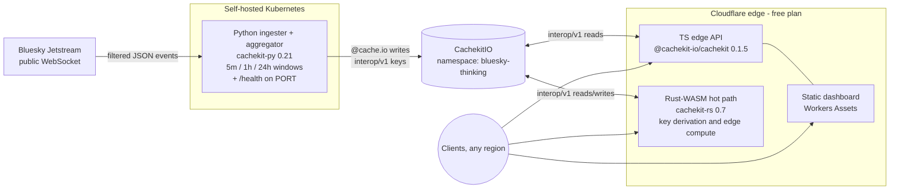

# Skyline (`bluesky-thinking`)

**Live Bluesky firehose analytics, served from one CacheKit namespace by three SDKs.**

Skyline turns the public [Bluesky Jetstream](https://github.com/bluesky-social/jetstream) into
rolling analytics — trending hashtags, links, language mix, posts-per-minute, top emoji — computed
by a Python ingester, served from a TypeScript edge API, with a Rust-WASM hot path, all reading and
writing the **same** [CacheKit](https://cachekit.io) cache entries. The demo *is* a live cross-SDK
interop test, and a working proof of CacheKit's differentiators:

Public trend signals are Unicode-normalized, tracking-aware, source-bounded, and
safety-filtered under the transparent [Skyline public signal policy](docs/signal-policy.md).

- **Metered-misses pricing made literal** — a cache miss is a real window recompute; the hit rate
  is the product story.
- **Distributed locking** — concurrent misses on one window trigger exactly one recompute
  (stampede prevention via the CachekitIO SaaS lock endpoints).
- **Zero-knowledge encryption** — a sensitive derived cache uses `@cache.secure`; the backend
  stores ciphertext only.
- **≈ $0/month** — all third-party hosting stays inside free tiers (cost table below).

> Status: **live** — dashboard + API at
> [`skyline-edge.raywalker.workers.dev`](https://skyline-edge.raywalker.workers.dev), ingester
> self-hosted on Kubernetes ([`deploy/k3s/`](deploy/k3s/) — egress-only, no public URL; `/health`
> is reachable via `kubectl port-forward`), hot path at
> [`skyline-hotpath.raywalker.workers.dev`](https://skyline-hotpath.raywalker.workers.dev).
> Re-verify any time with
> [`stage4/verify.sh`](stage4/verify.sh) (reachability, `X-Cache: HIT` from a non-origin POP,
> payload freshness). Architecture contract in [`docs/architecture.md`](docs/architecture.md).

## Architecture


```mermaid
flowchart LR
    JS[Bluesky Jetstream\npublic WebSocket] -->|filtered JSON events| ING

    subgraph Self-hosted Kubernetes
        ING[Python ingester + aggregator\ncachekit-py 0.21\n5m / 1h / 24h windows\n+ /health on PORT]
    end

    ING -->|"@cache.io writes\ninterop/v1 keys"| CK[(CachekitIO\nnamespace: bluesky-thinking)]

    subgraph Cloudflare edge - free plan
        API[TS edge API\n@cachekit-io/cachekit 0.1.5]
        WASM[Rust-WASM hot path\ncachekit-rs 0.7\nkey derivation and edge compute]
        DASH[Static dashboard\nWorkers Assets]
    end

    CK <-->|interop/v1 reads| API
    CK <-->|interop/v1 reads/writes| WASM
    API --- DASH
    Browser((Clients, any region)) --> DASH & API & WASM
```

All three SDKs address the cache with **interop/v1** keys (`bluesky-thinking:{operation}:{args_hash}`)
— byte-identical across languages, proven in the spike (see below). Full contract:
[`docs/architecture.md`](docs/architecture.md).

## Spike results (2026-07-24)

| Check | Result | Evidence |
| :--- | :--- | :--- |
| Python decorators `@cache.production` / `@cache.secure` / `@cache.io` | ✅ present + run on `cachekit==0.15.0` (PyPI) | [`spike/decorators/`](spike/decorators/) |
| `cachekit-rs` compiles for `wasm32-unknown-unknown` | ✅ SDK CI recipe + downstream consumer crate | [`spike/edge-worker/`](spike/edge-worker/) |
| `cachekit-rs` Worker **deploys and runs** on Cloudflare | ✅ deployed and ran live on the Workers edge, 180 KiB gzipped, 2 ms startup | [`spike/edge-worker/`](spike/edge-worker/) |
| Cross-SDK key byte-compatibility | ✅ Python (PyPI), TS (npm), Rust (live CF edge) all derive `bluesky-thinking:posts_per_minute:230037de…` | [`docs/architecture.md`](docs/architecture.md#locked-key-convention) |
| CachekitIO namespace + credentials | ✅ dedicated demo tenant provisioned; round-trip verified against the live CachekitIO backend | [`docs/architecture.md`](docs/architecture.md#credentials) |
| Free-tier hosts chosen | ✅ Self-hosted container (ingester; Render free tier until 2026-08-29) · Cloudflare Workers free (edge) | [`docs/architecture.md`](docs/architecture.md#hosting) |

## Cost table

Third-party hosting only, with the **binding** limit for each row — not just "free". Verified
against the providers' published limits, 2026-07-29.

| Component | Host | Binding free-tier limit | Skyline's use | Cost |
| :--- | :--- | :--- | :--- | ---: |
| Jetstream feed | Bluesky public infra | none (public, no auth) | 1 outbound WebSocket | $0 |
| Python ingester | Self-hosted Kubernetes ([`deploy/k3s/`](deploy/k3s/))¹ | n/a — self-hosted; the binding limits are the Deployment's own (320 MiB request / 512 MiB memory limit, measured against live Jetstream) | one single-replica Deployment, egress-only | $0 |
| Edge API + dashboard + Rust-WASM hot path | Cloudflare Workers free plan | **100k requests/day and 10 ms CPU per invocation, shared across both Workers** (`skyline-edge` incl. its cron, `skyline-hotpath`) | cached reads, ≪ limits; the hot path is reached by service binding (its subrequests don't hit the public URL) | $0 |
| History-capture cron | Cloudflare cron trigger on `skyline-edge` | cron triggers are free; each firing counts as a request in the same 100k/day budget; **5 cron expressions per account** | 24 fires/day (hourly) ≈ **744/month — 0.02 % of the daily request budget**. Was every 10 min when it doubled as the Render keep-alive ping; that job died with the Render deployment | $0 |
| Snapshot history store | Cloudflare D1 (`skyline-history`) | **100k rows written/day · 5M rows read/day · 5 GB storage (account-wide)** | ≈250 writes/day, ≤40 MiB steady state, reads bounded by CacheKit + POP response caching — budgets in [`docs/history.md`](docs/history.md) | $0 |
| Cache backend | CachekitIO (ours) | n/a — dogfood | one demo tenant | $0² |
| **Total** | | | | **$0/mo** |

¹ The ingester ran on a Render free web service until 2026-08-29, then moved to a self-hosted
container. `GET /health` on `$PORT` — a Render web-service requirement originally — stays as the
Kubernetes liveness probe: 503 while Jetstream is disconnected, so a sustained-dead consumer gets the
container restarted. Restarts lose in-memory window state, mitigated by checkpointing aggregation
state into CacheKit (`posts_per_minute` and signal-candidate totals restore exactly; per-minute
trending and language counters are top-K-truncated, so long-tail counts are approximate). That
truncation is **steady-state, not just post-restart**: memory is bounded by design (measured, and
encoded as the Deployment's memory limit), so a minute bucket keeps every distinct key
only while it is inside the live 5 m window and is then compacted to its top-K entries — see
[`ingester/README.md`](ingester/README.md#window-retention-and-memory).
² CachekitIO is the platform being showcased — we build, run, and own it. No third-party line item.

Fly.io was evaluated and **rejected**: its free tier was discontinued in 2024 (new orgs get a
one-time trial credit only; an always-on 256 MB machine bills ≈ $2/mo). Oracle Cloud's always-free
VM was dropped before launch (credit-card requirement); Render replaced it, and a self-hosted
container replaced Render in turn on 2026-08-29.

## Deploy

Deploys are by hand by design — `kubectl` for the ingester, `wrangler` for both Workers.
CI gates all three components on PR + push
(path-filtered): [`ingester-qa`](.github/workflows/ingester-qa.yml),
[`edge-qa`](.github/workflows/edge-qa.yml) and [`hotpath-qa`](.github/workflows/hotpath-qa.yml),
and [`ingester-image`](.github/workflows/ingester-image.yml) builds the container on PR and
publishes `ghcr.io/cachekit-io/skyline-ingester` (commit-SHA tag only, no `latest`) on merge to `main`.

- **Ingester (self-hosted Kubernetes)**: a single egress-only container; manifests in
  [`deploy/k3s/`](deploy/k3s/). The CachekitIO endpoint and credentials are supplied at deploy
  time as a Kubernetes Secret, never committed. The full runbook (create the Secret, render and
  apply, verify the probe) is [`deploy/k3s/README.md`](deploy/k3s/README.md). The ingester
  **fails closed** without both credentials. The manifest carries an image-tag sentinel that the
  runbook renders to a commit SHA at every apply, so the deployed reference is always immutable; rolling out a new image is the same
  render-and-apply with a newer SHA — there is no git-push auto-deploy, and a pod restart is never
  an implicit upgrade.
- **Edge + hot path (Cloudflare)**: `cd edge && npx wrangler deploy` ·
  `cd hotpath && npx wrangler deploy` (see each component's README for secrets).
- **Verification**: [`stage4/verify.sh`](stage4/verify.sh) probes reachability, `X-Cache: HIT`,
  payload freshness and the hit-rate counters against the live deployment.

## Repository layout

```
deploy/k3s/            — ingester Kubernetes manifests + deploy runbook
docs/architecture.md   — the architecture spec (locked cross-SDK contract)
docs/history.md        — aggregate-snapshot history: design decision, budgets, privacy/retention
edge/                  — TS edge API + dashboard: CF Worker serving the five aggregates (interop/v1 reads, X-Cache + hit-rate stats) + Workers Assets dashboard
hotpath/               — Rust-WASM hot-path Worker (cachekit-rs 0.7 on CF Workers):
                         interop key derivation, xxHash3 payload verification, window-slice
                         merging — live at skyline-hotpath.raywalker.workers.dev
ingester/              — Python ingester + window aggregator: Jetstream → 5m/1h/24h windows → interop/v1 aggregates
stage3/                — live-integration evidence harness: clean-namespace audit, SDK-free
                         raw/ciphertext reader, stampede (distributed-lock) proof
spike/decorators/      — proof: the three decorators running on cachekit 0.15.0
spike/edge-worker/     — proof: deployable cachekit-rs Worker (the live spike)
spike/roundtrip/       — CachekitIO round-trip harness, runs once credentials exist
```

Spike code is throwaway by design — the production ingester, API and dashboard replaced it.

## License

MIT — see [LICENSE](LICENSE).
